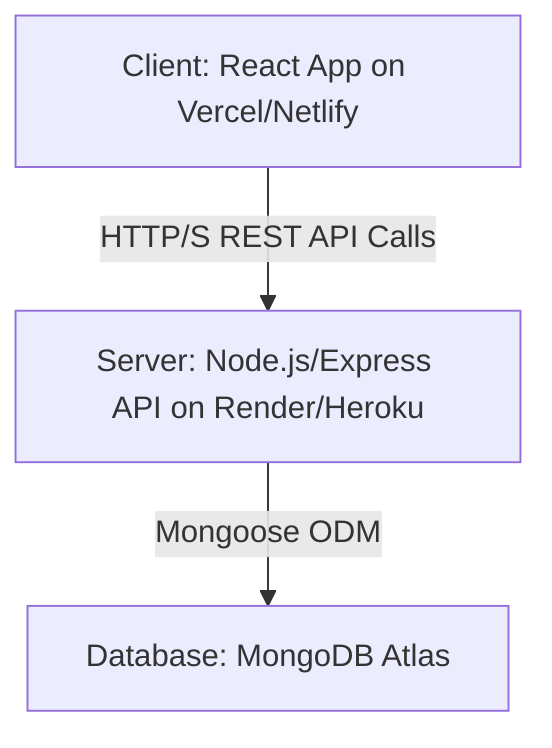
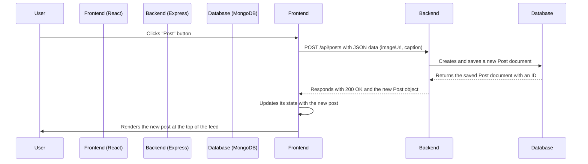

### 📸 Socialify 
A full-stack (MERN Stack) social media web application built from the ground up, inspired by modern platforms like Instagram. This project showcases a complete MERN stack implementation with a feature-rich frontend, a robust backend API, and a persistent database.

## ✨ Features
- **Dynamic Post Feed:** A real-time feed that fetches and displays all user posts.

- **Create Posts:** Users can create new posts with an image URL and a caption, which are instantly added to the feed.

- **Like Posts:** Interactive "like" functionality with a real-time counter.

- **User Profiles:** A dedicated page to display user information and a grid of their posts.

- **Client-Side Routing:** Seamless navigation between the feed and profile pages without page reloads.

- **Loading & Error States:** A professional user experience with loading spinners during data fetching and clear error messages.

- **RESTful API:** A well-structured backend API to handle all data operations.

## 🛠️ Tech Stack
This project is built using the MERN stack and other modern web technologies.

| Category   | Technology |
|------------|------------|
| **Frontend** | React, Vite, Material-UI (MUI), React Router |
| **Backend**  | Node.js, Express, Mongoose |
| **Database** | MongoDB (with MongoDB Atlas for cloud hosting) |
| **Dev Tools** | ESLint, Nodemon, dotenv, CORS |

## 🏛️ Architecture & Internal Workings
This application follows a classic client-server architecture, with the frontend (client) completely decoupled from the backend (server).

  - **Client (React App):** The frontend is a Single Page Application (SPA) built with React. It handles all the user interface logic. When it needs data, it makes API calls to the backend server. It never interacts with the database directly.

  - **Server (Node.js/Express API):** The backend is a RESTful API that listens for requests from the client. It handles all business logic, such as creating, reading, and updating posts. It communicates with the MongoDB database to store and retrieve data.

  - **Database (MongoDB):** The database stores all the application data (posts, users, etc.) in a structured way.

**High-Level Architecture Diagram**



**How Creating a Post Works (Sequence Diagram)**

This diagram shows the journey of a new post, from the user clicking "Post" to it being saved in the database and appearing on the screen.



## 📁 Folder & File Structure

The project is organized into two main parts: the root (/) for the frontend and the /server directory for the backend.

```

/social-media-app-mern
├── /public/              # Static assets for the frontend
├── /src/                 # React frontend source code
│   ├── /components/      # Reusable React components (Post, NewPostForm, etc.)
│   ├── /pages/           # Page-level components (FeedPage, ProfilePage)
│   ├── App.jsx           # Main app component with routing logic
│   └── main.jsx          # Entry point for the React application
├── /server/              # Node.js backend source code
│   ├── /controllers/     # Logic for handling requests (getPosts, createPost)
│   ├── /models/          # Mongoose schemas (Post.js, User.js)
│   ├── /routes/          # API route definitions (posts.js, user.js)
│   ├── .env              # Environment variables (DB connection string)
│   └── server.js         # Entry point for the backend server
├── .gitignore            # Files and folders to ignore in Git
├── package.json          # Frontend dependencies and scripts
└── README.md             # You are here!

```

## 🚀 Local Development Setup

To run this project on your local machine, follow these steps:

Prerequisites:

- Node.js (v18 or later)

- npm

- A free MongoDB Atlas account

1. Clone the Repository:
   ```
   git clone https://github.com/mdnm18/social-media-app-mern.git
   cd social-media-app-mern
   
   ```
2. Setup the Backend:
   ```
    # Navigate to the server directory
    cd server

    # Install backend dependencies
    npm install
    
    # Create a .env file in the /server directory and add your variables
    # MONGO_URI=your_mongodb_atlas_connection_string
    # PORT=5000
    
    # Start the backend server
    npm start

   ```
   The backend will be running on http://localhost:5000.
   
3. Setup the Frontend:
   ```
    # Navigate back to the root directory from /server
    cd ..
    
    # Install frontend dependencies
    npm install
    
    # Start the frontend development server
    npm run dev

   ```
   The frontend will be running on http://localhost:5173.

## 📈 Future Enhancements
    
   This project has a solid foundation that can be extended with many more features:

      [ ] User Authentication: Full sign-up, login, and logout functionality using JWT.
      
      [ ] Comments: Allow users to comment on posts.
      
      [ ] Backend "Like" Logic: Persist likes in the database.
      
      [ ] Image Uploads: Allow users to upload images from their devices instead of using URLs (using services like Cloudinary or AWS S3).
      
      [ ] Deployment: Deploy the frontend to Vercel and the backend to Render to make the app live on the web.
      
      [ ] User Profiles: Ability to view other users' profiles.
      
      [ ] Follow System: Implement following/unfollower functionality.

  

  
